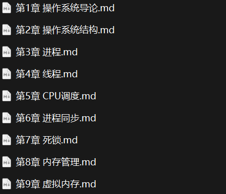
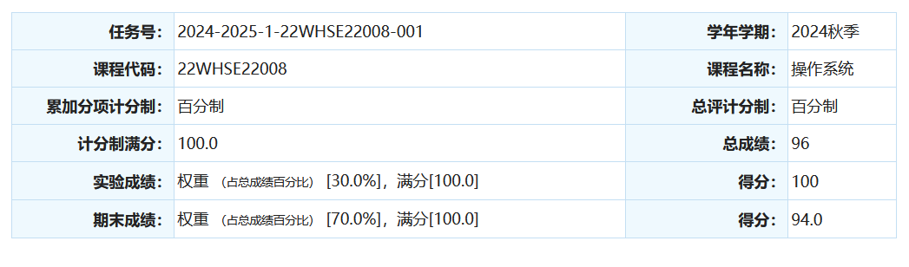

# 操作系统

## 0. 省流极速版

| 基础               | 上课   | 查出勤                               | 实验                       | 考前准备    |
| ------------------ | ------ | ------------------------------------ | -------------------------- | ----------- |
| 一点计算机组成原理 | 需要听 | 基本不查，会象征性传点名册自己写名字 | 可以不好好做但是要理解实验 | 背诵整个ppt |

## 1. 课程内容

课程主要讲解计算机操作系统，涉及多个模块如CPU，内存，磁盘等，是比较硬的课，但是课程非常简单。以下为每一章笔记的标题，可以参考课程内容。



## 2. 是否学习的建议

| 学习人群 | 学习建议                                                     |
| -------- | ------------------------------------------------------------ |
| 就业     | 面试会涉及操作系统，但是和我们学校教授内容不一致，建议自行学习，效率更高 |
| 考研     | 不推荐上课学习，和408重点完全不一致。                        |
| 保研     | 不太能拉分，朴给分都很高，但是保研还是要好好学               |

> "大春，我告诉你，你和别人不一样，千万别把时间浪费在学习上"

## 3. 考试内容&&考试题

考题形式为填空题+简答题+应用题。填空和简答都是ppt上的文字或者问题，应用题是实验和一些计算（如lru调度，给你一个情景要求给出正确调度顺序）。值得注意的是填空，简答都是致死量，并且挖空的地方有时候让人难以预测，基本上就是ppt上有，考试真的就敢出。

整体难度中等偏下。

考试的时候我虽然做完了还有比较长的时间，但是谨慎的我决定检查，于是到考前5分钟我才开始写面经，但是没想到朴直接说没什么人了收卷，所以这部分大家要自己搜集，因为考试难度低，一定有面经留下了。

分数：

其实这一门课给分都很高。我主要错误地方是实验部分，有道题出的是linux线程调度。因为做实验的时候我不看结果，直接把指令都输进去就截图了，加上考试之前我认为实验考察形式可能是代码挖空（前一年），只看了有代码的几个实验。结果考试直接不会了，结果也是因为没有猜到这道题中暗黑心理学，直接估计全扣了（5分？）😋。（说实话这道题没研究过实验真的很难作对）

## 4. 学习建议

> 建议针对保研同学，其他同学可以适量删减

1. 实验要好好做，或者至少每个实验都要心中有数，不能忽视，因为实验题没做真的难猜。实验报告一般不会卡分可以不用太卷。（~~如果做不出来可以开动脑筋自己写个程序模拟输出~~）
1. 上课要听。朴有上课的时候划重点的习惯，本来往年都是会在最后一节课再总结一遍所有的重点的，但是24fall不知为何没有总结。所以不确定之后还会不会期末划重点，最好平时还是听一听，上课的时候会强调考试题。另外小彩蛋，每年朴都会在讲死锁的时候让大家猜一个描述死锁发生原因的字：“贪”。我们这一届也确实有一道填空考了。
1. 如果时间充裕，追求完美，可以提前学一遍408在听课，但是408内容和讲授内容重合度一般，很多上课大讲特讲的都是408中的底边。所以考前一样还得背ppt。好处是能够构建起一个公认的操作系统知识体系，就算上课讲的跳跃也不会影响理解。
1. 如果追求性价比可以直接背ppt。推荐是每周都做总结并背诵，不然考试压力会较大。就我的经验，背诵我写的笔记大概需要3-4天，从早背到晚。平时没背也是考前时间不足实验没有完全复习的一个原因。

## 5. 资料介绍

```
2024_Fall_yt
│
├── assets
│
├── Exam
│   ├── Notes 					// 根据每章ppt总结的超级详细的笔记，涵盖99.99%知识点
│   ├── Slides 					// ppt
│   └── Past Papers				// 往年题，但是没有我这一年的，大家自己找应该很好找
│
└── Lab							// 实验报告
    ├── Lab1					
    ├── Lab2				
    ├── Lab3					
    ├── Lab4					
    ├── Lab5
    ├── Lab6
    ├── Lab7
    ├── Lab8
    └── Lab9					
```


