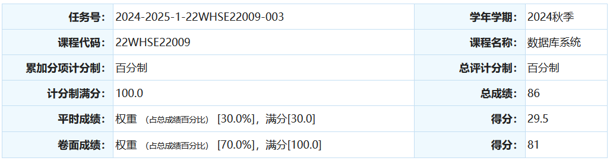
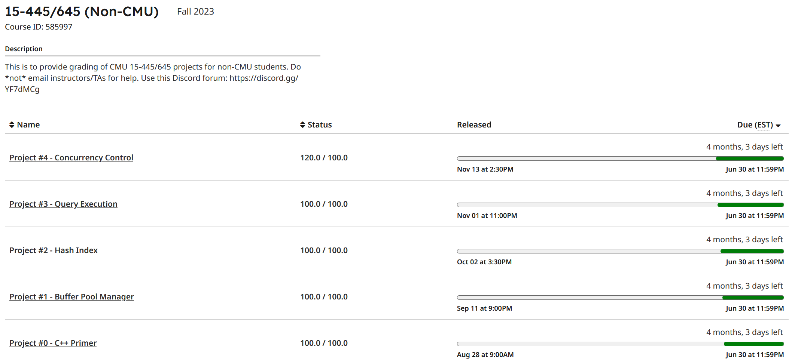

# 数据库

## 0. 省流极速版

| 基础                 | 上课                             | 查出勤                           | 实验       | 考前准备 |
| -------------------- | -------------------------------- | -------------------------------- | ---------- | -------- |
| 会一点算法和数据结构 | 看情况数据库软件可能是分开教学了 | 看情况数据库软件可能是分开教学了 | 需要好好做 | ppt      |

## 1. 课程内容

主要包括数据库的应用（sql，数据库设计）以及数据库的实现。数据库应用部分较为简单，但是范式对于第一次接触的同学来说可能是挺有难度的（和数学一样），但是理解后就还可以。后半部分是数据库实现，和算法与数据结构紧密联系。

注意这个课虽然是专业课并且要算保研分数，但是教学上是分给两个老师教学的，类似于马原毛概（非常难以评价，据说是因为老师不够，这就是我们哈维软件的抽象操作之一，希望你们那一届就会变成一个老师吧）。从而上课可能会因为分开教学，使用不同ppt，老ppt整个课程是相当有难度的，可以出的很难，但是非常条理清晰层层递进。新ppt纯背诵，并且知识体系是乱七八糟的，用来学习数据库可能不如老ppt。个人认为大大降低了课程难度，又回到了威海校区相对于本部一贯的简单一档，和软件构造，形式语言一样，都是相对于本部考出了威海特色：背诵。

## 2. 是否学习的建议

| 学习人群 | 学习建议                                                     |
| -------- | ------------------------------------------------------------ |
| 就业     | 有一点面试题，但是不太推荐学习                               |
| 考研     | 不推荐认真学习，考试通过即可                                 |
| 保研     | 学习方法依然基于分开教学。不过看出题趋势以后应该就是会逐步用新ppt了 |

## 3. 考试内容&&考试题

考题包含多种题型，具体可以参考res from others我们学长的2020年考题，没有太大变动。考题和平时作业题型都是高度一致的，平时作业要多复习研究。

今年的难度非常低。但是我们这一届很奇怪，本来有两个ppt都在用来讲课，按理来说就算我们代课老师用的新ppt，我用新/老ppt复习都一样，但是考试有些地方考了只有新ppt上有的概念类知识点。

分数：

为什么这么低，我也不知道，也**不给查卷**。

不过不用太担心，这门课给分还是很高的，据考前不到一周突击的同学说上个90没什么问题。

成绩分布我们这一年一共7个班级，567班级86分以上25人，1234班级86分以上50人。

## 4. 学习建议

因为考的过低，所以我只能说说我失败的学习经历。如果你想要的是成功经验可以忽略。

暑假：cmu15445视频课+《数据库系统概念》（和课程有关的一部分）阅读并做笔记；第一次打印老ppt学习并做笔记。

开学后：两个老师的课，听了两遍；cmu15445 2023fall project（纯自己写没看一点题解，考前未作优化）；每周复习本周内容并复习。

考前：提前一周开始复习老ppt，从头到尾打印出来重做了笔记；复习平时作业；给室友讲题；复习往年题；总结题型；考前总结背诵部分并背诵。



多的东西不想说了，祝大家都可以取得自己想要的成绩。

## 5. 资料介绍

```
2024_Fall_yt
│
├── assets
│
├── Exam
│   ├── Slides 					// ppt
│   └── writings				// 老ppt范式部分笔记和乱七八糟的b-plus-tree笔记（注意和上课教的有细微差别）
│
└── Res_From_others 			// 学长的往年题
```


