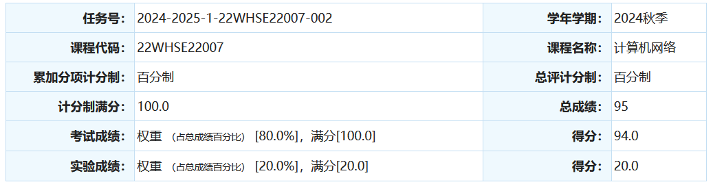

# 计算机网络

## 0. 省流极速版

| 基础       | 上课   | 查出勤               | 实验     | 考前准备          |
| ---------- | ------ | -------------------- | -------- | ----------------- |
| 无特定基础 | 可以听 | 完全没有考勤和平时分 | 需要完成 | 背诵往年题复习ppt |

## 1. 课程内容

这门课是以自顶向下的顺序来讲计算机网络，就是从应用层讲起一直到数据链路层。因此课程重心不在实现而在上层的协议，学习时要注意区分自底向上的计算机网络，教学的重心有差别。

## 2. 是否学习的建议

| 学习人群 | 学习建议                                                 |
| -------- | -------------------------------------------------------- |
| 就业     | 可以学习，有些内容面试会出现                             |
| 考研     | 不推荐认真学习，可以学习408，加上看往年题目也可以应付    |
| 保研     | 可以努力卷一卷，但是拉不开差距（在你们都写完了的情况下） |

## 3. 考试内容&&考试题

考试形式为简答题简答题简答题简答题简答题和计算题和一道每年都出的综合题目。简答题变化范围较大，经常出一些风马牛不相及的东西。例如让你比较一些看起来没有任何相同点概念的差异。计算题计算方法很简单，但是计算量极大，24fall就是有一道7还是8个结点的图要按特定方法计算最优路径，基本上就是用脑子遍历所有路径，非常恶心！最后一题每年都一样，一定会出，是一道大简答，考前背过默写即可。

题目难度低，整体难度高。原因就是要杀了人的题目量，绝大部分（我认识的人）都是勉强写完或者根本没写完分全扔了。我在考试的时候一开始写的很慢，原因是他会把一堆小问题放到一个5分的题目，就第一题我就写满了都写不下，后面还有极其恶心的计算，加上最后一题我准备的字数过多（1-2k字），导致我的时间非常不够用，后面直接把卷子写出火星了，10分钟写了一面（将近10道简答），不过刘洋老师还是通情达理的，认真研究了我的鬼画符。

考试的时候我都做不完了，那面经就别想了，但是我可以负责任的说，考试中的所有题目全是在我总结的大题笔记中出现过了。如果你时间充裕可以直接背诵。

成绩：



虽然写成了鬼画符但是还是给了分👍

## 4. 学习建议

> 建议针对保研同学，其他同学可以适量删减

1. 最重要的一点，考试90%都是往年题目，可能会有略微变动，比如计算题改一下，其余都不太动。因此最重要的就是看往年题！
1. 上课刘洋老师讲的很好，声音很有磁性，并且讲课也比较清楚，唯一的缺点就是我下来不复习，计网很依赖背诵，不复习就和学单词一样全忘了，如果全程跟下来应该可以取得一个不错的成绩。
1. 也可以听一听408网课，但是注意不能只听408，因为考研考的是自底向上，和考试相反，所以只可以作为补充或者是作为知识的框架。
1. 考试的时候一定写得快一点，要是你选择背我的笔记，注意里面答案都是我自己写的，不是标准答案所以**写的非常长**，考试一定不能这么直接默写，有些地方可以只写一个分店的第一句话就走，不然加上7，8个节点的计算题是真的写不过来。

## 5. 资料介绍

```
2024_Fall_yt
│
├── assets
│
├── Exam
│   ├── Notes					// 笔记
│   ├── Slides 					// ppt
│   └── Past_Papers				// 往年题（还是没有我这一年的）
│
├── Lab							// 实验
└── Res_From_others 			// 其他学长的资料
```


