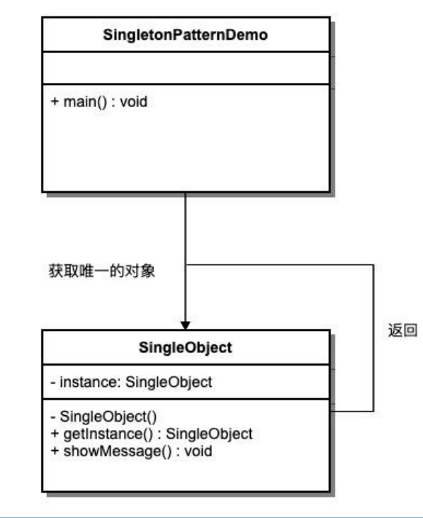
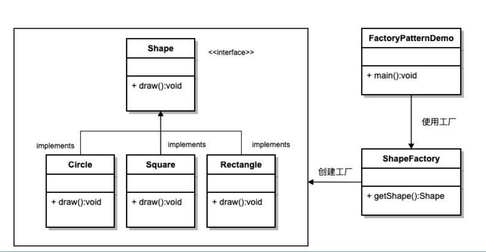
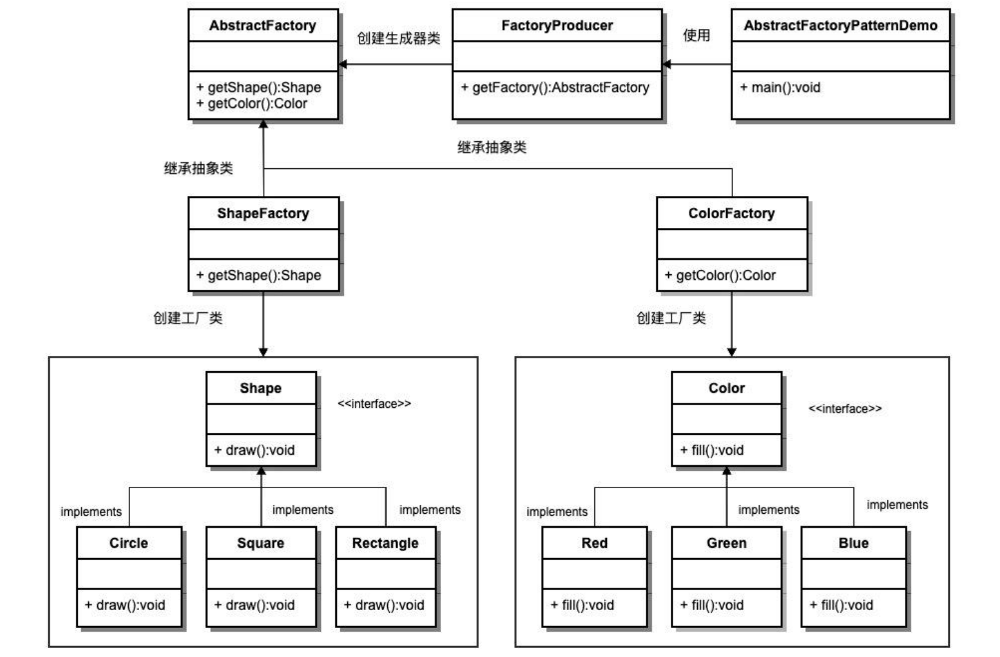
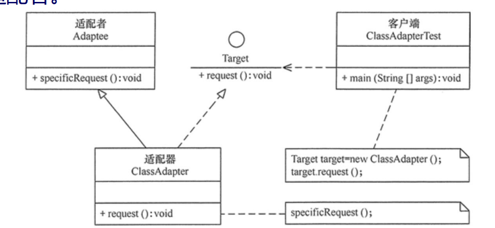
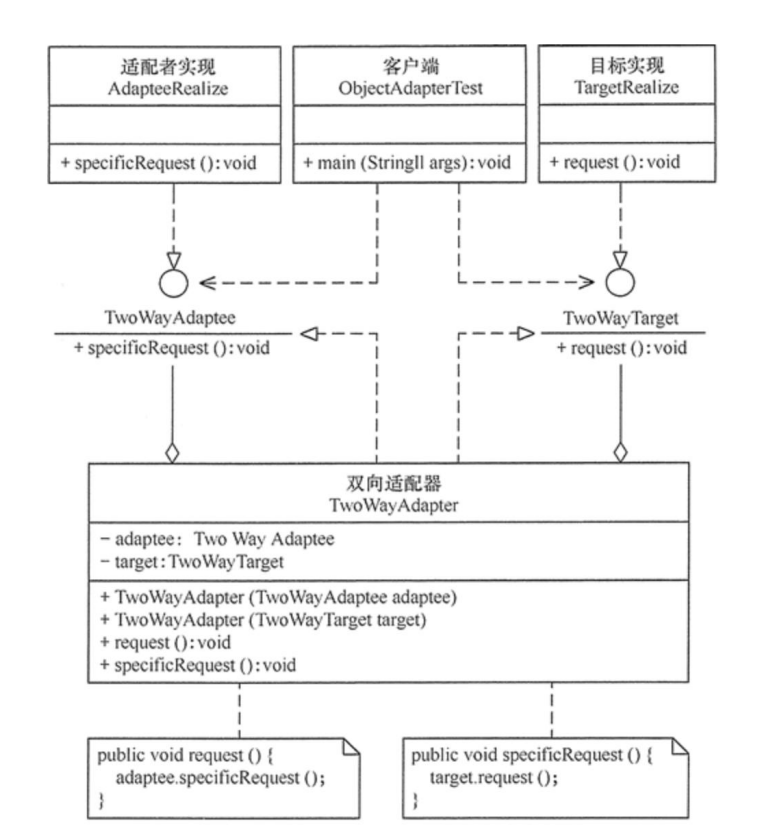
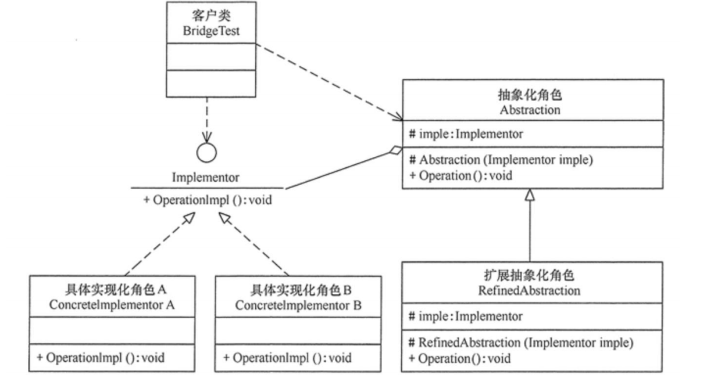
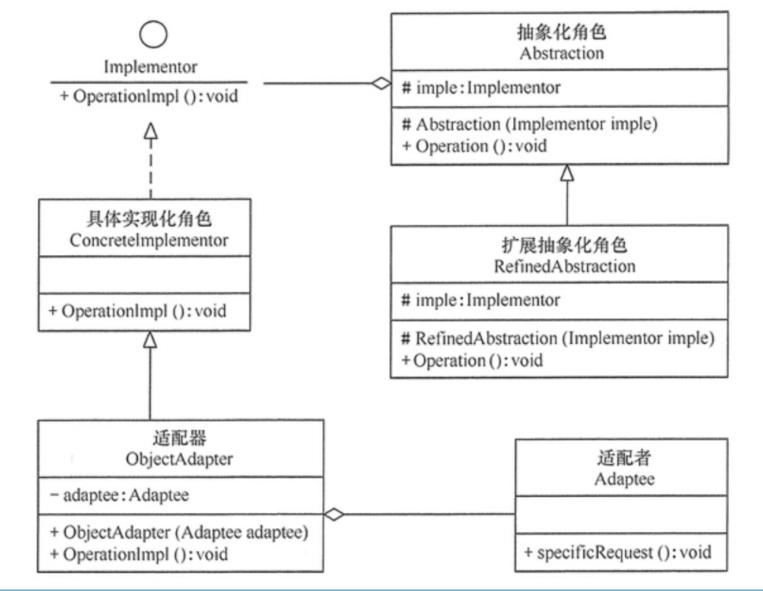
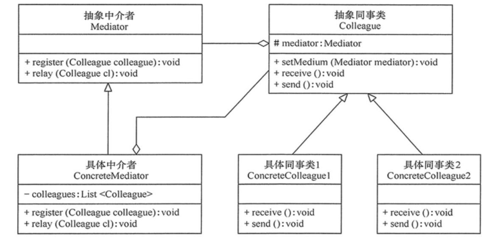
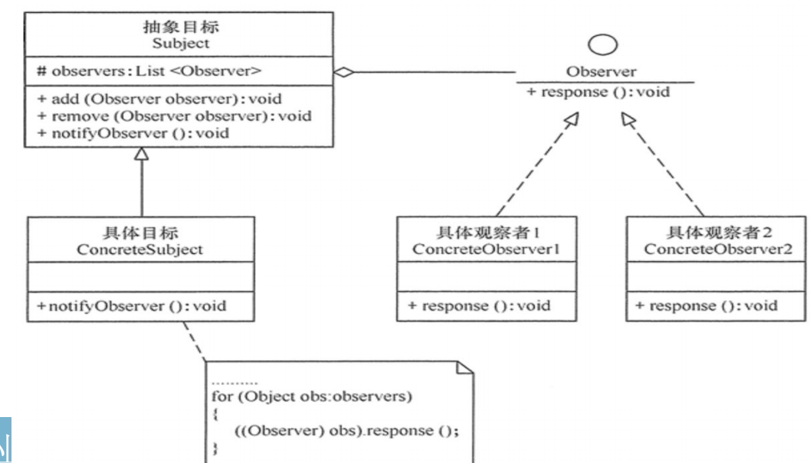
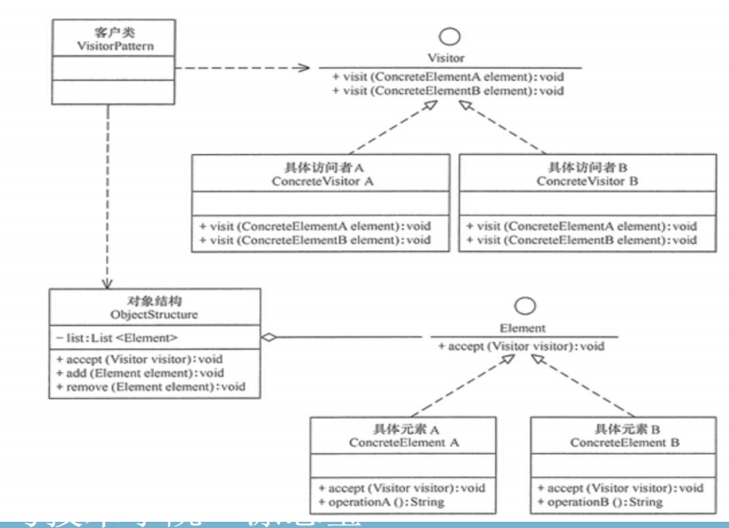

# Chapter2-2
### 1. 创建型模式的要点

不允许显示创建

### 2. 单例模式的定义

单例模式提供了一种创建对象的最佳方式。单例模式涉及到一个单一的类：该类负责创建自己的对象，并确保只有单个对象被创建。该类提供了一种访问其唯一的对象的方式，可以直接访问，不需要实例化该类的对象。

### 3. 单例模式的注意点

1. 单例类只能有一个实例。
2. 单例类必须自己创建自己的唯一实例。
3. 单例类必须给所有其他对象提供这一实例。

### 4. 单例模式的特点

1. **模式意图**：保证一个类仅有一个实例，并提供一个访问它的全局访问点。
2. **解决问题**：一个全局使用的类频繁地创建与销毁。
3. **使用时机**：当你想控制实例数目，节省系统资源的时候。
4. **解决方案**：判断系统是否已经有这个单例，如果有则返回，如果没有则创建。
5. **关键代码**：构造函数是私有的。

### 5. 单例模式的关键点

别人无法创建自己可以创建，别人可以获取

### 6. 单例实现的方式

1. **懒汉式**，线程不安全（最基础的实现方式）
   
   1. Lazy 初始化
   
   2. 无多线程安全，在多线程不能正常工作
   
   3. 没有加锁 synchronized，严格意义上它并不算单例模式
   
   4. ```java
      public class SingletonLazyUnsafe {
          private static SingletonLazyUnsafe instance;
          private SingletonLazyUnsafe() {}
          public static SingletonLazyUnsafe getInstance() {
              if (instance == null) {
                  instance = new SingletonLazyUnsafe();
              }
              return instance;
          }
      }
      ```
   
2. **懒汉式**，线程安全
   
   1. Lazy 初始化：第一次调用才初始化，避免内存浪费。
   2. 多线程安全，能够在多线程中很好的工作，但是，效率很低，99% 情况下不需要同步。
   3. 缺点：必须加锁 synchronized 才能保证单例，但加锁会影响效率。
   4. ```java
      public class SingletonLazySafe {
          private static SingletonLazySafe instance;
          private SingletonLazySafe() {}
          public static synchronized SingletonLazySafe getInstance() {
              if (instance == null) {
                  instance = new SingletonLazySafe();
              }
              return instance;
          }
      }
      ```
   
3. **饿汉式**
   
   1. 无Lazy 初始化，比较常用，类加载时就初始化，浪费内存，容易产生垃圾对象。
   
   2. 多线程安全：是，没有加锁，执行效率会提高。
   
   3. 基于 classloader 机制避免了多线程的同步问题，不过，instance 在类装载时就实例化。
   
   4. ```java
      public class SingletonEager {
          private static final SingletonEager instance = new SingletonEager();
          private SingletonEager() {}
          public static SingletonEager getInstance() {
              return instance;
          }
      }
      ```
   
4. **双检锁**/**双重校验锁**（DCL，即 double-checkedlocking）
   
   1. JDK 版本：JDK1.5 起
   
   2. Lazy 初始化
   
   3. 多线程安全：采用双锁机制，安全且在多线程情况下能保
   
   4. 持高性能。
   
   5. ```java
      public class SingletonDCL {
          private static volatile SingletonDCL instance;
          private SingletonDCL() {}
          public static SingletonDCL getInstance() {
              if (instance == null) {
                  synchronized (SingletonDCL.class) {
                      if (instance == null) {
                          instance = new SingletonDCL();
                      }
                  }
              }
              return instance;
          }
      }
      ```
   
5. **登记式**/**静态内部类**
   
   1. Lazy 初始化：利用了 classloader 机制来保证初始化instance 时只有一个线程，而Singleton 类被装载了，instance 不一定被初始化。
   
   2. SingletonHolder 类没有被主动使用，只有通过显式调用getInstance 方法时，才会显式装载 SingletonHolder类，从而实例化 instance。实现Singleton类延迟加载。
   
   3. 多线程安全：达到双检锁的功效
   
   4. ```java
      public class SingletonHolder {
          private SingletonHolder() {}
          private static class Holder {
              private static final SingletonHolder INSTANCE = new SingletonHolder();
          }
          public static SingletonHolder getInstance() {
              return Holder.INSTANCE;
          }
      }
      ```

### 7. 单例模式的优缺点

- **优点**
  1. 在内存里只有一个实例，减少了内存的开销，尤其是频繁的创建和销毁实例。
  2. 避免对资源的多重占用（比如写文件操作）。
- **缺点**：没有接口，不能继承，与单一职责原则冲突，一个类应该只关心内部逻辑，而不关心外面怎么样来实例化。

### 8. 单例模式的使用场景及注意事项

1. 要求生产唯一序列号。
2. WEB 中的计数器，不用每次刷新都在数据库里加一次，用单例先缓存起来。
3. 创建的一个对象需要消耗的资源过多，比如 I/O 与数据库的连接。
4. 注意事项：getInstance() 方法中需要使用同步锁 synchronized(Singleton.class) 防止多线程同时进入造成 instance 被多次实例化。

### 9. 工厂模式的定义

工厂模式提供了一种创建对象的最佳方式。工厂模式在创建对象时不会对客户端暴露创建逻辑，并且是通过使用一个共同的接口来指向新创建的对象。

```java
class ShapeFactory {
    public static Shape getShape(String shapeType) {
        if ("CIRCLE".equalsIgnoreCase(shapeType)) {
            return new Circle();
        } else if ("RECTANGLE".equalsIgnoreCase(shapeType)) {
            return new Rectangle();
        }
        return null;
    }
}
public class SimpleFactoryDemo {
    public static void main(String[] args) {
        Shape shape1 = ShapeFactory.getShape("CIRCLE");
        shape1.draw();

        Shape shape2 = ShapeFactory.getShape("RECTANGLE");
        shape2.draw();
    }
}
```

### 10. 工厂模式的特点

1. **模式意图**：定义一个创建对象的接口，让其子类自己决定实例化哪一个工厂类，工厂模式使其创建过程延迟到子类进行。
2. **解决问题**：主要解决接口选择的问题。
3. **使用时机**：明确地计划不同条件下创建不同实例时。解决方案：让其子类实现工厂接口，返回的也是一个抽象的产品。
4. **关键代码**：创建过程在其子类执行。

### 11. 工厂模式的优缺点

- **优点**
  1. 一个调用者想创建一个对象，只要知道其名称就可以了。
  2. 扩展性高，如果想增加一个产品，只要扩展一个工厂类即可。
  3. 屏蔽产品的具体实现，调用者只关心产品的接口。
- **缺点**
  1. 每次增加一个产品时，都需要增加一个具体类和对象实现工厂，使得系统中类的个数成倍增加。
  2. 在一定程度上增加了系统的复杂度，同时也增加了系统具体类的依赖。

### 12. 工厂模式的使用场景及注意事项

- **使用场景**
  1. 日志记录器：记录可能记录到本地硬盘、系统事件、远程服务器等，用户可以选择记录日志到什么地方。
  2. 数据库访问，当用户不知道最后系统采用哪一类数据库，以及数据库可能有变化时。
  3. 设计一个连接服务器的框架，需要三个协议，"POP3""IMAP""HTTP"，可以把这三个作为产品类，共同实现一个接口。
- **注意事项**
  1. 作为一种创建类模式，在任何需要生成复杂对象的地方，都可以使用工厂方法模式。
  2. 需要注意的地方就是复杂对象适合使用工厂模式，而简单对象，特别是只需要通过 new 就可以完成创建的对象，无需使用工厂模式。如果使用工厂模式，就需要引入一个工厂类，会增加系统的复杂度。

### 13. 抽象工厂模式的定义

抽象工厂模式是围绕一个超级工厂创建其他工厂。该超级工厂又称为其他工厂的工厂，提供了一种创建对象的最佳方式。在抽象工厂模式中，接口是负责创建一个相关对象的工厂，不需要显式指定它们的类。每个生成的工厂都能按照工厂模式提供对象。

### 14. 抽象工厂模式的特点

1. **模式意图**：提供一个创建一系列相关或相互依赖对象的接口，而无需指定它们具体的类。
2. **解决问题**：主要解决接口选择的问题。
3. **使用时机**：系统的产品有多于一个的产品族，而系统只消费其中某一族的产品。
4. **解决方案**：在一个产品族里面，定义多个产品。
5. **关键代码**：在一个工厂里聚合多个同类产品。

### 15. 抽象工厂的优缺点

- **优点**：当一个产品族中的多个对象被设计成一起工作时，它能保证客户端始终只使用同一个产品族中的对象。
- **缺点**：产品族扩展非常困难，要增加一个系列的某一产品，既要在抽象的 Creator 里加代码，又要在具体的里面加代码。

### 16. 抽象工厂的使用场景和注意事项

- **使用场景**
  1. QQ 换皮肤，一整套一起换。
  2. 生成不同操作系统的程序。
- **注意事项**：产品族难扩展，产品等级易扩展。

### 17. 适配器模式的定义

适配器模式（Adapter Pattern）是作为两个不兼容的接口之间的桥梁。这种类型的设计模式属于结构型模式，它结合了两个独立接口的功能。适配器模式涉及到一个单一的类，该类负责加入独立的或不兼容的接口功能。

### 18. 适配器模式的特点

1. **模式意图**：将一个类的接口转换成客户希望的另外一个接口。适配器模式使得原本由于接口不兼容而不能一起工作的那些类可以一起工作。
2. **解决问题**：解决在软件系统中，常常要将一些"现存的对象"放到新的环境中，而新环境要求的接口是现对象不能满足的。
3. **使用时机**：（1）系统需要使用现有的类，而此类的接口不符合系统的需要。（2）想要建立一个可以重复使用的类，用于与一些彼此之间没有太大关联的一些类，包括一些可能在将来引进的类一起工作，这些源类不一定有一致的接口。（3）通过接口转换，将一个类插入另一个类系中。
4. **解决方案**：继承或依赖（推荐）
5. **关键代码**：适配器继承或依赖已有的对象，实现想要的目标接口

### 19. 适配器模式的实现

1. **目标**（Target）接口：当前系统业务所期待的接口，它可以是抽象类或接口。
2. **适配者**（Adaptee）类：它是被访问和适配的现存组件库中的组件接口。
3. **适配器**（Adapter）类：它是一个转换器，通过继承或引用适配者的对象，把适配者接口转换成目标接口，让客户按目标接口的格式访问适配者。

```java
interface Target {
    void request();
}
class Adaptee {
    public void specificRequest() {
        System.out.println("Called specificRequest from Adaptee");
    }
}
class Adapter extends Adaptee implements Target {
    @Override
    public void request() {
        specificRequest();
    }
}
public class ClassAdapterDemo {
    public static void main(String[] args) {
        Target target = new Adapter();
        target.request();
    }
}
```

```java
interface Target {
    void request();
}
class Adaptee {
    public void specificRequest() {
        System.out.println("Called specificRequest from Adaptee");
    }
}
class Adapter implements Target {
    private Adaptee adaptee;
    public Adapter(Adaptee adaptee) {
        this.adaptee = adaptee;
    }
    @Override
    public void request() {
        adaptee.specificRequest();
    }
}
public class ObjectAdapterDemo {
    public static void main(String[] args) {
        Adaptee adaptee = new Adaptee();
        Target target = new Adapter(adaptee);
        target.request();
    }
}
```

### 20. 双向适配器模式的定义

1. 同时实现两个接口（**目标接口**和**适配者接口**）。

2. 内部持有适配者或目标接口的对象（对象适配器的方式）。

3. 转换逻辑可以在两种方向上进行。

### 21. 适配器模式的优缺点

- **优点**
  1. 可以让任何两个没有关联的类一起运行。
  2. 提高了类的复用。
  3. 增加了类的透明度。
  4. 灵活性好。
- **缺点**：过多地使用适配器，会让系统非常零乱，不易整体进行把握。比如，明明看到调用的是 A 接口，其实内部被适配成了 B 接口的实现，一个系统如果太多出现这种情况，无异于一场灾难。因此如果不是很有必要，可以不使用适配器，而是直接对系统进行重构。

### 22. 适配器模式的使用场景和注意事项

- **使用场景**：有动机地修改一个正常运行的系统的接口，这时应该考虑使用适配器模式。
- **注意事项**：适配器不是在详细设计时添加的，而是解决正在服役的项目的问题。

### 23. 桥接模式的定义

**桥接模式**（Bridge Pattern）通过提供抽象化和实现化之间的桥接结构，来实现二者的解耦。桥接模式涉及到一个作为桥接的接口，使得实体类的功能独立于接口实现类。这两种类型的类可被结构化改变而互不影响。

### 24. 桥接模式的特点

1. **模式意图**：将抽象部分与实现部分分离，使它们都可以独立的变化。
2. **解决问题**：在有多种可能会变化的情况下，用继承会造成类爆炸问题，扩展起来不灵活。
3. **使用时机**：实现系统可能有多个角度分类，每一种角度都可能变化。
4. **解决方案**：把这种多角度分类分离出来，让它们独立变化，减少它们之间耦合。
5. **关键代码**：抽象类依赖实现类。

### 25. 桥接模式的实现

1. **抽象化**（Abstraction）角色：定义抽象类，并包含一个对实现化对象的引用。
2. **扩展抽象化**（Refined Abstraction）角色：是抽象化角色的子类，实现父类中的业务方法，并通过组合关系调用实现化角色中的业务方法。
3. **实现化**（Implementor）角色：定义实现化角色的接口，供扩展抽象化角色调用。
4. **具体实现化**（Concrete Implementor）角色：给出实现化角色接口的具体实现。 

```java
interface Implementor {
    void operationImpl();
}
class ConcreteImplementorA implements Implementor {
    @Override
    public void operationImpl() {
        System.out.println("ConcreteImplementorA operation");
    }
}
abstract class Abstraction {
    protected Implementor implementor;
    public Abstraction(Implementor implementor) {
        this.implementor = implementor;
    }
    public abstract void operation();
}
class RefinedAbstraction extends Abstraction {
    public RefinedAbstraction(Implementor implementor) {
        super(implementor);
    }
    public void operation() {
        System.out.print("RefinedAbstraction: ");
        implementor.operationImpl();
    }
}
public class BridgePatternDemo {
    public static void main(String[] args) {
        Implementor implementorA = new ConcreteImplementorA();
        Abstraction abstractionA = new RefinedAbstraction(implementorA);
        abstractionA.operation();
    }
}
```

### 26. 桥接模式的优缺点

- **优点**
  1. 抽象和实现的分离。
  2. 优秀的扩展能力。
  3. 实现细节对客户透明。
- **缺点**：桥接模式的引入会增加系统的理解与设计难度，由于聚合关联关系建立在抽象层，要求开发者针对抽象进行设计与编程。

### 27. 桥接模式的使用场景和注意事项

- **使用场景**
  1. 如果一个系统需要在构件的抽象化角色和具体化角色之间增加更多的灵活性，避免在两个层次之间建立静态的继承联系，通过桥接模式可以使它们在抽象层建立一个关联关系。
  2. 对于那些不希望使用继承或因为多层次继承导致系统类的个数急剧增加的系统，桥接模式尤为适用。
  3. 一个类存在两个独立变化的维度，且这两个维度都需要进行扩展。
- **注意事项**：对于两个独立变化的维度，使用桥接模式再适合不过了。

### 28. 桥接模式和适配器结合使用

当桥接模式的实现化角色的接口与现有类的接口不一致时，可以在二者中间定义一个适配器将二者连接起来

### 29. 代理模式/委托模式的定义

由于某些原因需要给某对象提供一个代理以控制对该对象的访问。这时，访问对象不适合或者不能直接引用目标对象，代理对象作为访问对象和目标对象之间的中介。

### 30. 代理模式的特点

1. **模式意图**：为其他对象提供一种代理以控制对这个对象的访问。
2. **解决问题**：在直接访问对象时带来的问题，比如说：要访问的对象在远程的机器上。在面向对象系统中，有些对象由于某些原因（比如对象创建开销很大，或者某些操作需要安全控制，或者需要进程外的访问），直接访问会给使用者或者系统结构带来很多麻烦，我们可以在访问此对象时加上一个对此对象的访问层。
3. **使用时机**：想在访问一个类时做一些控制。
4. **解决方案**：增加中间层。
5. **关键代码**：实现与被代理类组合。

### 31. 静态代理的内容

```java
interface Subject {
    void request();
}
class RealSubject implements Subject {
    public void request() {
        System.out.println("RealSubject: Handling request.");
    }
}
class Proxy implements Subject {
    private RealSubject realSubject;
    public void request() {
        System.out.println("Proxy: Performing pre-processing.");
        if (realSubject == null) {
            realSubject = new RealSubject();
        }
        realSubject.request();
        System.out.println("Proxy: Performing post-processing.");
    }
}
public class ProxyPatternDemo {
    public static void main(String[] args) {
        Subject proxy = new Proxy();
        proxy.request();
    }
}
```

### 32. 静态代理的优缺点

- **优点**：可以做到在不修改目标对象的功能前提下，对目标功能扩展。
- **缺点**：因为代理对象需要与目标对象实现一样的接口，所以会有很多代理类,类太多。同时，一旦接口增加方法，目标对象与代理对象都要维护。

### 33. 动态代理的内容

JDK自带动态代理。其通过自己实现InvocationHandler来实现动态代理，真正的代理对象由JDK再运行时为我们动态的来创建。

### 34. 动态代理实现

```java
class DynamicProxyHandler implements InvocationHandler {
    private Object target;
    public DynamicProxyHandler(Object target) {
        this.target = target;
    }
    public Object invoke(Object proxy, Method method, Object[] args) throws Throwable {
        System.out.println("Proxy: Performing pre-processing.");
        Object result = method.invoke(target, args);
        System.out.println("Proxy: Performing post-processing.");
        return result;
    }
}
public class JDKDynamicProxyDemo {
    public static void main(String[] args) {
        RealSubject realSubject = new RealSubject();
        Subject proxy = (Subject) Proxy.newProxyInstance(
                RealSubject.class.getClassLoader(),
                new Class[]{Subject.class},
                new DynamicProxyHandler(realSubject)
        );
        proxy.request();
    }
}
```

### 35. 动态代理的总结

虽然相对于静态代理，动态代理大大减少了我们的开发任务，同时减少了对业务接口的依赖，降低了耦合度。但是JDK自带动态代理只能支持实现了Interface的类。是实现Spring AOP的基础。

### 36. 动态代理的优缺点

- **优点**
  1. 代理模式在客户端与目标对象之间起到一个中介作用和保护目标对象的作用；
  2. 代理对象可以扩展目标对象的功能；例如我们想给项目加入缓存、日志这些功能，我们就可以使用代理类来完成，而没必要打开已经封装好的委托类。
  3. 代理模式能将客户端与目标对象分离，在一定程度上降低系统的耦合度；
- **缺点**
  1. 在客户端和目标对象之间增加一个代理对象，会造成请求处理速度变慢；
  2. 增加了系统的复杂度；

### 37. 代理模式按职责划分的使用场景

1. 远程代理
2. 虚拟代理
3. Copy-on-Write 代理
4. 保护代理
5. Cache代理
6. 防火墙代理
7. 同步化代理
8. 智能引用代理

### 38. 中介者模式的定义

中介者模式定义一个中介对象来封装一系列对象之间的交互，使原有对象之间的耦合松散，且可以独立地改变它们之间的交互。中介者模式又叫调停模式，它是迪米特法则的典型应用。中介者模式是用来降低多个对象和类之间的通信复杂性。这种模式提供了一个中介类，该类通常处理不同类之间的通信，并支持松耦合，使代码易于维护。

### 39. 中介者模式的特点

1. **模式意图**：用一个中介对象来封装一系列的对象交互，中介者使各对象不需要显式地相互引用，从而使其耦合松散，而且可以独立地改变它们之间的交互。
2. **解决问题**：对象与对象之间存在大量的关联关系，这样势必会导致系统的结构变得很复杂，同时若一个对象发生改变，我们也需要跟踪与之相关联的对象，同时做出相应的处理。
3. **使用时机**：多个类相互耦合，形成了网状结构。
4. **解决方案**：将网状结构分离为星型结构。
5. **关键代码**：对象 Colleague 之间的通信封装到一个类中单独处理。

### 40. 中介者模式的实现

1. **抽象中介者**（Mediator）角色：它是中介者的接口，提供了同事对象注册与转发同事对象信息的抽象方法。
2. **具体中介者**（ConcreteMediator）角色：实现中介者接口，定义一个 List 来管理同事对象，协调各个同事角色之间的交互关系，因此它依赖于同事角色。
3. **抽象同事类**（Colleague）角色：定义同事类的接口，保存中介者对象，提供同事对象交互的抽象方法，实现所有相互影响的同事类的公共功能。
4. **具体同事类**（Concrete Colleague）角色：是抽象同事类的实现者，当需要与其他同事对象交互时，由中介者对象负责后续的交互。

```java
interface Mediator {
    void sendMessage(String message, Colleague colleague);
    void registerColleague(Colleague colleague);
}
class ConcreteMediator implements Mediator {
    private List<Colleague> colleagues = new ArrayList<>();
    public void registerColleague(Colleague colleague) {
        colleagues.add(colleague);
    }
    public void sendMessage(String message, Colleague sender) {
        for (Colleague colleague : colleagues) {
            if (colleague != sender) {
                colleague.receiveMessage(message);
            }
        }
    }
}
abstract class Colleague {
    protected Mediator mediator;
    public Colleague(Mediator mediator) {
        this.mediator = mediator;
    }
    public abstract void receiveMessage(String message);
    public abstract void sendMessage(String message);
}
class ColleagueA extends Colleague {
    public ColleagueA(Mediator mediator) {
        super(mediator);
    }
    public void receiveMessage(String message) {
        System.out.println("Colleague received: " + message);
    }
    public void sendMessage(String message) {
        System.out.println("Colleague sends: " + message);
        mediator.sendMessage(message, this);
    }
}
public class MediatorPatternDemo {
    public static void main(String[] args) {
        Mediator mediator = new ConcreteMediator();
        Colleague colleagueA = new ColleagueA(mediator);
		Colleague colleagueB = new colleagueA(mediator);
        mediator.registerColleague(colleagueA);
        mediator.registerColleague(colleagueB);
        colleagueA.sendMessage("Hello from A!");
        colleagueB.sendMessage("Hello from B!");
    }
}
```

### 41. 中介者模式和单例模式结合

不定义中介者接口，把具体中介者对象实现成为单例。同事对象不持有中介者，而是在需要的时候直接获取中介者对象并调用。

### 42. 中介者模式的的优缺点

- **优点**
  1. 降低了类的复杂度，将一对多转化成了一对一。
  2. 各个类之间的解耦。
  3. 符合迪米特原则。
- **缺点**：中介者会庞大，变得复杂难以维护。

### 43. 中介者模式的使用场景和注意事项

- **使用场景**
  1. 系统中对象之间存在比较复杂的引用关系，导致它们之间的依赖关系结构混乱而且难以复用该对象。
  2. 想通过一个中间类来封装多个类中的行为，而又不想生成太多的子类。
- **注意事项**：不应当在职责混乱的时候使用。

### 44. 观察者模式的定义

又被称为发布-订阅/模型-视图模式，属于行为型设计模式的一种。是一个在项目中经常使用的模式。指多个对象间存在一对多的依赖关系，当一个对象的状态发生改变时，所有依赖于它的对象都得到通知并被自动更新。

### 45. 观察者模式的特点

1. **模式意图**：定义对象间的一种一对多的依赖关系，当一个对象的状态发生改变时，所有依赖于它的对象都得到通知并被自动更新。
2. **解决问题**：一个对象状态改变给其他对象通知的问题，而且要考虑到易用和低耦合，保证高度的协作。
3. **使用时机**：一个对象（目标对象）的状态发生改变，所有的依赖对象（观察者对象）都将得到通知，进行广播通知。
4. **解决方案**：使用面向对象技术，可以将这种依赖关系弱化。
5. **关键代码**：在抽象类里有一个 ArrayList 存放观察者们。

### 46. 观察者模式的实现

1. **抽象目标**（Subject）角色：提供一个用于保存观察者对象的聚集类和增加、删除观察者对象的方法，以及通知所有观察者的抽象方法。
2. **具体目标**（Concrete Subject）角色：实现抽象目标中的通知方法，当具体主题的内部状态发生改变时，通知所有注册过的观察者对象。
3. **抽象观察者**（Observer）角色：是一个抽象类或接口，它包含了一个更新自己的抽象方法，当接到具体主题的更改通知时被调用。
4. **具体观察者**（Concrete Observer）角色：实现抽象观察者中定义的抽象方法，以便在得到目标的更改通知时更新自身的状态。

```java
interface Subject {
    void registerObserver(Observer observer);
    void removeObserver(Observer observer);
    void notifyObservers();
}
class ConcreteSubject implements Subject {
    private List<Observer> observers = new ArrayList<>();
    private String state;
    public void registerObserver(Observer observer) {
        observers.add(observer);
    }
    public void removeObserver(Observer observer) {
        observers.remove(observer);
    }
    public void notifyObservers() {
        for (Observer observer : observers) {
            observer.update(state);
        }
    }
    public void setState(String state) {
        this.state = state;
        notifyObservers();
    }
}
interface Observer {
    void update(String state);
}
class ConcreteObserver implements Observer {
    private String name;
    public ConcreteObserver(String name) {
        this.name = name;
    }
    public void update(String state) {
        System.out.println(name + " received update: " + state);
    }
}
public class ObserverPatternDemo {
    public static void main(String[] args) {
        ConcreteSubject subject = new ConcreteSubject();
        Observer observer1 = new ConcreteObserver("Observer 1");
        Observer observer2 = new ConcreteObserver("Observer 2");
        subject.registerObserver(observer1);
        subject.registerObserver(observer2);
        subject.setState("State Changed to A");
        subject.setState("State Changed to B");
    }
}
```

### 47. 观察者模式的注意事项

实现观察者模式时要注意具体目标对象和具体观察者对象之间不能直接调用，否则将使两者之间紧密耦合起来，这违反了面向对象的设计原则。

### 48. 观察者模式的扩展

在 Java 中，通过 java.util.Observable 类和java.util.Observer 接口定义了观察者模式，只要实现它们的子类就可以编写观察者模式实例。

1. **Observable**类：用 Vector 向量存所有要通知的观察者对象，包含3 个方法。
   1. void addObserver(Observer o) 方法：将新的观察者对象添加到向量中。
   2.  void notifyObservers(Object arg) 方法：调用向量中的所有观察者对象的update方法，通知它们数据发生改变。
   3. void setChange() 方法：用来设置一个 boolean 类型的内部标志位，注明目标对象发生了变化。当它为真时，notifyObservers() 才会通知观察者。
2. **Observer** 接口：监视目标对象的变化，当目标对象发生变化时，观察者得到通知，并调用 void update(Observable o,Object arg) 方法，进行相应的工作。

```java
public class ConcreteSubject extends Observable {
    private String state;
    public void setState(String state) {
        this.state = state;
        setChanged();
        notifyObservers(state);
    }
    public String getState() {
        return state;
    }
}
public class ConcreteObserver implements Observer {
    private String name;
    public ConcreteObserver(String name) {
        this.name = name;
    }
    public void update(Observable o, Object arg) {
        System.out.println(name + " received update: " + arg);
    }
}
public class ObserverPatternWithJavaAPI {
    public static void main(String[] args) {
        ConcreteSubject subject = new ConcreteSubject();
        ConcreteObserver observer1 = new ConcreteObserver("Observer 1");
        ConcreteObserver observer2 = new ConcreteObserver("Observer 2");
        subject.addObserver(observer1);
        subject.addObserver(observer2);
        subject.setState("State Changed to A");
        subject.setState("State Changed to B");
    }
}
```

### 49. 观察者模式的优缺点

- **优点**
  1. 观察者和被观察者是抽象耦合的。
  2. 建立一套触发机制。
- **缺点**
  1. 如果一个被观察者对象有很多的直接和间接的观察者的话，将所有的观察者都通知到会花费很多时间。
  2. 如果在观察者和观察目标之间有循环依赖的话，观察目标会触发它们之间进行循环调用，可能导致系统崩溃。
  3. 观察者模式没有相应的机制让观察者知道所观察的目标对象是怎么发生变化的，而仅仅只是知道观察目标发生了变化。

### 50. 观察者模式的使用场景和注意事项

- **使用场景**
  1. 一个抽象模型有两个方面，其中一个方面依赖于另一个方面。将这些方面封装在独立的对象中使它们可以各自独立地改变和复用。
  2. 一个对象的改变将导致其他一个或多个对象也发生改变，而不知道具体有多少对象将发生改变，可以降低对象之间的耦合度。
  3. 一个对象必须通知其他对象，而并不知道这些对象是谁。需要在系统中创建一个触发链，A对象的行为将影响B对象，B对象的行为将影响C对象……，可以使用观察者模式创建一种链式触发机制。
- **注意事项**
  1. JAVA 中已经有了对观察者模式的支持类。
  2. 避免循环引用。
  3. 如果顺序执行，某一观察者错误会导致系统卡壳，一般采用异步方式。

### 51. 访问者模式的定义

将作用于某种数据结构中的各元素的操作分离出来封装成独立的类，使其在不改变数据结构的前提下可以添加作用于这些元素的新的操作，为数据结构中的每个元素提供多种访问方式。将对数据的操作与数据结构进行分离，是行为类模式中最复杂的一种模式。

### 52. 访问者模式的特点

1. **模式意图**：主要将数据结构与数据操作分离。
2. **解决问题**：稳定的数据结构和易变的操作耦合问题。
3. **使用时机**：需要对一个对象结构中的对象进行很多不同的并且不相关的操作，而需要避免让这些操作"污染"这些对象的类，使用访问者模式将这些封装到类中。
4. **解决方案**：在被访问的类里面加一个对外提供接待访问者的接口。
5. **关键代码**：在数据基础类里面有一个方法接受访问者，将自身引用传入访问者。

### 53. 访问者模式的实现

1. **抽象访问者**（Visitor）角色：定义一个访问具体元素的接口，为每个具体元素类对应一个访问操作 visit() ，其参数类型标识了被访问的具体元素。
2. **具体访问者**（ConcreteVisitor）角色：实现抽象访问者角色中声明的各个访问操作，确定访问者访问一个元素时该做什么。
3. **抽象元素**（Element）角色：声明一个包含接受操作 accept() 的接口，被接受的访问者对象作为 accept() 方法的参数。
4. **具体元素**（ConcreteElement）角色：实现抽象元素角色提供的accept() 操作，其方法体通常都是 visitor.visit(this) ，另外具体元素中可能还包含本身业务逻辑的相关操作。
5. **对象结构**（Object Structure）角色：是一个包含元素角色的容器，提供让访问者对象遍历容器中的所有元素的方法，通常由 List、Set、Map 等聚合类实现。


```java
interface Visitor {
    void visit(ElementA elementA);
    void visit(ElementB elementB);
}
class ConcreteVisitor implements Visitor {
    @Override
    public void visit(ElementA elementA) {
        System.out.println("Processing ElementA");
    }

    @Override
    public void visit(ElementB elementB) {
        System.out.println("Processing ElementB");
    }
}
interface Element {
    void accept(Visitor visitor);
}
class ElementA implements Element {
    public void accept(Visitor visitor) {
        visitor.visit(this);
    }
}
class ElementB implements Element {
    public void accept(Visitor visitor) {
        visitor.visit(this);
    }
}
class ObjectStructure {
    private Element[] elements;
    public ObjectStructure() {
        elements = new Element[]{new ElementA(), new ElementB()};
    }
    public void accept(Visitor visitor) {
        for (Element element : elements) {
            element.accept(visitor);
        }
    }
}
public class VisitorPatternDemo {
    public static void main(String[] args) {
        ObjectStructure objectStructure = new ObjectStructure();
        Visitor visitor = new ConcreteVisitor();
        objectStructure.accept(visitor);
    }
}
```

### 54. 访问者模式的优缺点

- **优点**
  1. 符合单一职责原则。
  2. 优秀的扩展性。
  3. 灵活性。
- **缺点**
  1. 具体元素对访问者公布细节，违反了迪米特原则。
  2. 具体元素变更比较困难。
  3. 违反了依赖倒置原则，依赖了具体类，没有依赖抽象。

### 55. 访问者模式的使用场景和注意事项

- **使用场景**
  1. 对象结构中对象对应的类很少改变，但经常需要在此对象结构上定义新的操作。
  2. 需要对一个对象结构中的对象进行很多不同的并且不相关的操作，而需要避免让这些操作"污染"这些对象的类，也不希望在增加新操作时修改这些类。
- **注意事项**：访问者可以对功能进行统一，可以做报表、UI、拦截器与过滤器。

### 类图

















