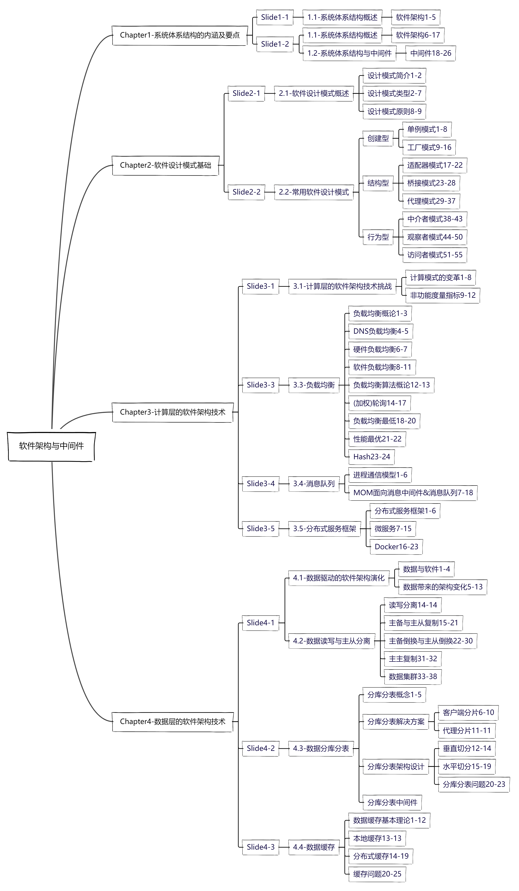
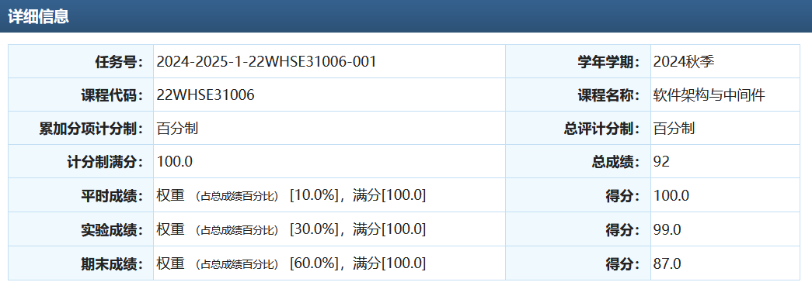

# 软件架构与中间件

## 0. 省流极速版

| 基础                   | 上课           | 查出勤               | 实验       | 考前准备                    |
| ---------------------- | -------------- | -------------------- | ---------- | --------------------------- |
| 会一点设计模式和`java` | 不（太）需要听 | 会不定时部分抽查点名 | 需要好好做 | 准备一张纸+认真理解每个知识 |

## 1. 课程内容

这个课程属于软工的专门的课程，主要讲设计模式+中间件介绍+常用的企业架构技术，就如同这个课程的标题一样，讲得非常的杂乱。需要有一定的工程基础，尤其是`java`和设计模式以及运维知识（配环境等）。下面是我自己做的索引，可以供同学们稍微了解一下。



## 2. 是否学习的建议

| 学习人群 | 学习建议                                                     |
| -------- | ------------------------------------------------------------ |
| 就业     | 有一部分面试题，但效率较低，不如直接背八股，不太推荐认真学习 |
| 考研     | 不推荐认真学习，考试通过即可                                 |
| 保研     | 可以努力卷一卷，但是拉不开差距                               |

> "消磨时间尚有更好的方法。想不想尝试一下？"

## 3. 考试内容&&考试题

考题形式为选择+大题。选择考察范围广，主要还是理解，如果没有完全理解每个概念仅仅走马观花并且没有工程经验是会有一些难度的。大题主要分为概念题和设计模式题。概念题就是PPT上的定义抄写，设计模式题就是一个设计模式原则改错和一道PPT例子换名字的设计模式补全题。

整体难度中等偏下。

考试的时候我虽然做完了还有比较长的时间（50mins），但是我有不确定的选择，所以最后没有记下考题，这里是回忆版。

1. 选择忘记了。*写了一两道，在纸上没带回来，记起来就补充*
2. 概念大题也忘记了，全是类似中间件定义，dns负载均衡定义这样的题目，都在整理的一张纸上。
3. 设计模式原则改错题，错误是不符合开闭原则，具体题目记不清了。举个例子，人可以开车和飞机，那么题目就是在人这个类里分别写了两个函数，一个开飞机，一个开汽车，实际上应该建立一个交通工具接口，人类直接调用接口而不是分别调用驾驶每个交通工具。
4. 设计模式补全题考了两个设计模式，一个桥接模式，一个适配器模式，全是换皮，一些地方挖空让你写，都在一张纸上。

分数：

说实话我觉得卷面有点低，可能是选择错的比较多.......大题总结自认为基本没有遗漏

## 4. 学习建议

> 建议针对保研同学，其他同学可以适量删减

1. 实验要好好做，因为实验是完全由助教来评分，两个助教一个博士一个硕士，博士给分严格，但是你做的很好会也给满分，硕士只要你做的像个样子就会给高分甚至满分。有个地方想吐槽为什么不让学生看自己评分，而且不公开评分标准。
2. 上课不需要听，我其实尝试听课但是太跳跃了，一直想走神。但是要去上课，因为会点名。
3. 考前理解所有PPT概念，知道不同概念的差别，例如DNS负载均衡和硬件负载均衡比较，考试不会默写但是会在选择题等地方出现，考察理解。
4. 准备好自己的一张纸，我资料里有我的制作过程，我首先用markdown总结了一遍ppt（ppt经常有一些意义不明的一段文字，没有标题的那种，所以如果我感觉他是知识点，就自己起个标题，因此可能出错。），然后把markdown导出为word，使用高级搜索搜索字体来选中正文/标题，然后还有各种办法来压缩，具体可以参考[BV1bv4y1h7fB](https://www.bilibili.com/video/BV1bv4y1h7fB/)。正文我是3.5磅，行距就比正文大0.1，彩印，打印可以去南门口的“歪歪图文”，他家是在校内两家打印店和南门口打印店打印的最清晰的，并且收费不高。值得注意的打印的时候要选自动调整页边距，防止最外面一圈打不出来。

## 5. 资料介绍

```
2024_Fall_yt
│
├── assets
│
├── Exam
│   ├── Final_Printing_Templete // 最后打印的模板
│   ├── Slides 					// ppt
│   ├── Slide_Summary			// markdown总结
│   │   └── assets
│   └── Slide_Summary_Compress	// 压缩版markdown总结
│       └── assets
│
├── Lab
│   ├── Lab1					// 第一次实验
│   │   ├── Instruction
│   │   │   └── code
│   │   ├── Report
│   │   └── Source
│   │       ├── Logistics_RabbitMQ
│   │       └── MiddlewareLab1
│   └── Lab2					// 第二次实验
│
└── Res_From_others 			// github上搜到的本部资料
```


